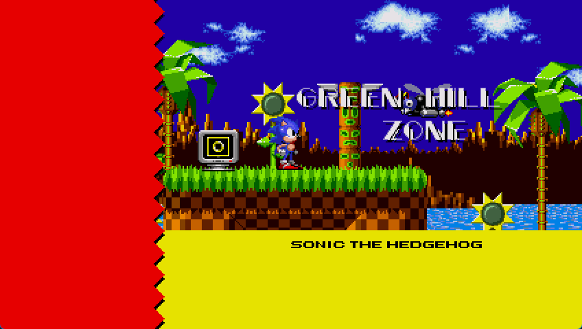

# Sonic Hybrid RSDK

Aims to mix different Sonic the Hedgehog games into a single big game.

## Start from here

This guide is useful if you never downloaded the project or if you want to start from scratch.

1. [Download](https://github.com/Xeeynamo/sonic-hybrid-rsdk/archive/refs/heads/main.zip) the latest release

1. Unpack the zip file

1. Paste in the directory `rsdk-source-data` the following files:

    * `Data.rsdk` from Sonic CD as `soniccd.rsdk`
    * `Data.rsdk` from Sonic 1 as `sonic1.rsdk`
    * `Data.rsdk` from Sonic 2 as `sonic2.rsdk`

1. Install [.NET 6](https://dotnet.microsoft.com/download/dotnet/6.0)

1. Open a terminal and run the command `dotnet run --project SonicHybridRsdk.Build`

1. Put the [RSDKv4](https://github.com/Rubberduckycooly/Sonic-1-2-2013-Decompilation/releases) engine in the `sonic-hybrid` folder

1. Run the RSDKv4 executable and have fun!

## Perform an update

This guide is useful if you previously played Sonic Hybrid but you want to perform an update. Please look at the [commit list](https://github.com/Xeeynamo/sonic-hybrid-rsdk/commits/main) to know more info about the changelog through each update.

1. [Download](https://github.com/Xeeynamo/sonic-hybrid-rsdk/archive/refs/heads/main.zip) the latest release

1. Unpack the zip file and overwrite all the existing files

1. Open a terminal and run the command `dotnet run --project SonicHybridRsdk.Build`

1. Run the RSDKv4 executable and have fun!

## Features

* Play Sonic 1, Sonic CD and Sonic 2 in a single big game.
* Star Posts in Sonic the Hedgehog 1 and CD will bring you to the Sonic the Hedgehog 2 special stages.
* Completing Sonic the Hedgehog 1's Final Zone will bring you to Palmtree Panic Zone.
* Completing Sonic the Hedgehog CD's Metallic Madness Act 3 will bring you to Emerald Hill Zone.
* The Stage Select in the debug menu will report all the implemented level names.
* Sonic CD stages correctly transitions as the original game.
* Metal Sonic is now a playable character.

## Known bugs

* Sonic 1 Special Stages are working from the Stage Select, but the graphics is corrupted.
* The main menu of RSDK will report the wrong stage names.
* The Giant Ring from Sonic the Hedgehog 1 will teleport to the Sonic the Hedgehog 2 special stages.
* Palmtree Panic, Collision Chaos and Stardust Speedway are half-implemented.
* Tidal Tempest, Quartz Quadrant, Wacky Workbench and Metallic Madness are barely implemented.
* Sonic CD levels does not have any enemy, unique gimmicks, palette cycles and working loops unless stated.
* Some Sonic CD's enemies and gimmicks might have the wrong palette.
* Playable Metal Sonic has a "rolling" bugging collision.

## Resources

I written [some notes](rsdkv3-to-rsdkv4.md) on how to convert RSDKv3 scripts to RSDKv4 scripts without modifying the RSDKv4 engine.

Everything contained in `rsdk/Scripts` is a modified version of [Rubberduckycooly's Sonic 1/2 script decompilation](https://github.com/Rubberduckycooly/Sonic-1-Sonic-2-2013-Script-Decompilation). This project would not exist without it.

The function `SonicHybridRsdk.Unpack12/DecryptData` was written by Giuseppe Gatta (nextvolume) from its [Retrun](http://unhaut.epizy.com/retrun/).
